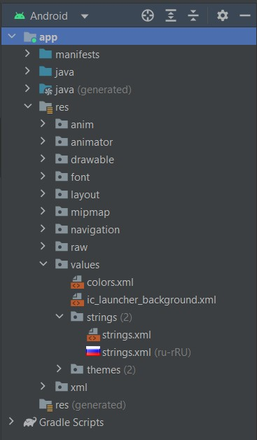

# Урок 9. Локализация приложений

Цели практической работы

Применить знания:
- по переводу приложения на русский и английский языки;
- по работе с DatePicker

Что нужно сделать:

1. Продолжаем усовершенствовать наше QUIZ-приложение.
2. На этом этапе за основу возьмите проект из предыдущей работы.

------------------------------------------------------------------

3. К предыдущему макету welcome-экрана добавьте кнопку, где попросите пользователя ввести 
дату его рождения. По нажатию на кнопку покажите DatePicker.

## Демонстрация решения:

------------------------------------------------------------------

4. Навесьте на него «слушатель» и считайте введённую дату.
5. После подтверждения выбора, используя форматтер, преобразуйте дату в человекоориентированный вид, 
например 03.01.22.
6. Покажите отформатированную дату в Snackbar (как в примере из видео).

## Демонстрация решения:

------------------------------------------------------------------

7. Переведите приложение на английский язык. Для этого создайте отдельную русскую локализацию 
и добавьте туда все строки на русском языке, а в дефолтной локали переводите все строки на английский язык.

## Демонстрация решения:

 

------------------------------------------------------------------

8. Проверьте, что всё работает корректно. Для этого поменяйте в настройках телефона язык системы.

## Демонстрация решения:

Английская локаль:

------------------------------------------------------------------

